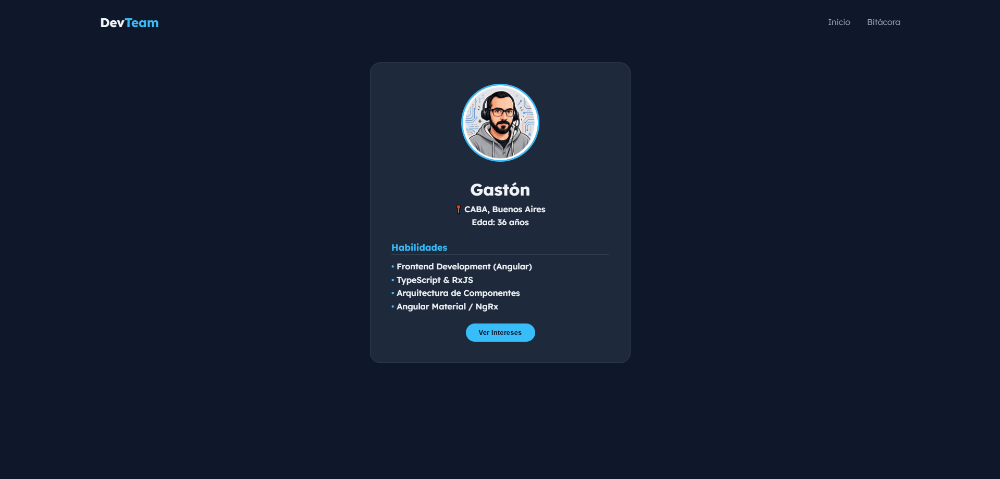
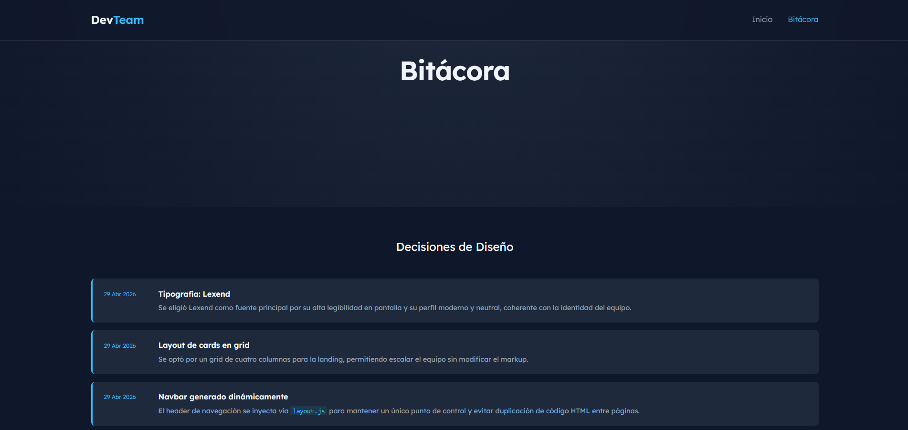

# DevTeam — TP1 Frontend Grupal

<!-- 🔴 REEMPLAZAR: agregar el link de deploy cuando esté disponible -->
🔗 **Deploy:** _pendiente_

---

## Descripción del Proyecto

Sitio web estático de presentación de equipo, desarrollado como trabajo práctico de la materia de Front End (3er año — Tecnicatura en Desarrollo de Software). El objetivo es construir una landing page con tarjetas de integrantes, perfiles individuales con interacción JavaScript, y una bitácora del proceso de desarrollo. Incluye navegación dinámica, efectos visuales, diseño responsive y toggle de contenido animado.

---

## Integrantes

| Nombre | GitHub |
|---|---|
| Martín Juan | [@Marto85](https://github.com/Marto85) |
| Gastón Zampar | [@zamparg](https://github.com/zamparg) |
| Adrián Madroñal | [@MaverickARG](https://github.com/MaverickARG) |
| Santiago Cuda | [@SantiCuda](https://github.com/SantiCuda) |

---

## Tecnologías Utilizadas

- **HTML5** — estructura semántica de todas las páginas
- **CSS3** — estilos, variables de color, animaciones con `@keyframes`, diseño responsive con media queries
- **JavaScript (ES6)** — interacción, DOM dinámico, animaciones controladas por eventos
- **[Google Fonts — Lexend](https://fonts.google.com/specimen/Lexend)** — tipografía principal
- **SVG** — favicon propio generado sin dependencias externas

---

## Estructura de Archivos

```
TP1-Frontend/
├── index.html              # Landing page principal
├── integrante1.html        # Perfil Martín
├── integrante2.html        # Perfil Martín (2do integrante)
├── integrante3.html        # Perfil Gastón
├── integrante4.html        # Perfil Adrián
├── bitacora.html           # Bitácora del proyecto
├── css/
│   └── styles.css          # Estilos globales, variables, animaciones, responsive
├── js/
│   ├── main.js             # Interacción hero, botón scroll-top
│   ├── layout.js           # Navbar dinámico compartido
│   ├── cards.js            # Toggle Perfil/Intereses con animación bounce
│   └── avatar-effects.js   # Efecto 3D hover sobre avatar
└── img/
    ├── favicon.svg         # Favicon DT del equipo
    └── avatar-*.png        # Avatares de cada integrante
```

---

## Guía de Estilos

### Paleta de Colores

| Rol | Variable CSS | Hexadecimal |
|---|---|---|
| Fondo principal | `--bg-dark` | `#0f172a` |
| Fondo de cards | `--bg-card` | `#1e293b` |
| Acento / Links | `--accent` | `#38bdf8` |
| Texto principal | `--text-main` | `#f1f5f9` |
| Texto secundario | `--text-dim` | `#94a3b8` |
| Navbar blur | `--nav-blur` | `rgba(15, 23, 42, 0.8)` |

### Tipografía

- **Lexend** — usada para títulos y cuerpo de texto  
  → [Ver en Google Fonts](https://fonts.google.com/specimen/Lexend)  
  Pesos utilizados: `300` (light), `400` / `500` (regular), `600` / `700` (bold)

### Iconografía y Avatares

- No se utiliza ninguna librería de íconos externa.
- El **favicon** es un SVG propio con las iniciales **DT** del equipo.
- Los **avatares** fueron generados con **Gemini AI** a partir de referencias fotográficas reales de los integrantes, preservando su privacidad al no publicar imágenes reales.

---

## Capturas de Pantalla

**Landing page**  


**Landing page - Botón de scroll**  


**Perfil de integrante**  


**Bitácora**  


---

## Funciones Implementadas

### 1) `toggleProfile()` — `js/cards.js`
Alterna entre la vista de **Perfil** (habilidades) y **Intereses** en cada página de integrante. Al hacer click, la card sube con una animación `slideOutUp`, se swapea el contenido y vuelve con `bounceInUp`. Usada en `integrante1-4.html` mediante el botón `#btn-toggle-info`.

### 2) Navbar dinámico — `js/layout.js`
Inyecta el HTML del menú de navegación en `#navbar-container`, compartido por todas las páginas. Marca el link activo según la URL actual.

### 3) Interacción hero — `js/main.js`
Escucha click en `#btn-interaccion`, hace scroll suave hacia `#integrantes` y muestra un efecto de texto temporal. Usado en `index.html`.

### 4) Botón flotante "Subir" — `js/main.js`
Crea dinámicamente un botón fijo en pantalla que aparece al descender más de 220px y vuelve al inicio con `scrollTo({ behavior: 'smooth' })`. Disponible en todas las páginas con `main.js`.

### 5) Efecto 3D en avatar — `js/avatar-effects.js`
Aplica rotación 3D dinámica (`rotateX` / `rotateY`) sobre `.profile-img` en función de la posición del cursor. Al salir el mouse, vuelve suavemente a su posición original.

---

## Uso de Inteligencia Artificial

| Herramienta | Uso |
|---|---|
| **ChatGPT** | Redacción de contenido, README y revisión de lógica general |
| **GitHub Copilot** | Autocompletado de código HTML y JavaScript |
| **Gemini** | Generación de avatares a partir de fotos reales de los integrantes |
| **Gemini Code Assist** | Optimización de CSS, responsive y variables de color |

Los avatares fueron generados con el siguiente prompt: *"Generar un avatar digital profesional y amigable, inspirado en una foto real, para un portfolio de equipo frontend."*

---

## Cómo Ejecutar

1. Clonar o descargar el repositorio.
2. Abrir `index.html` con **Live Server** en VS Code (o cualquier servidor local).
3. Navegar por las cards de integrantes para ver cada perfil.
4. El botón **"Descubrir Equipo"** hace scroll suave hacia la sección de miembros.

---

_Trabajo Práctico N°1 — Materia: Frontend — Tecnicatura en Desarrollo de Software_
